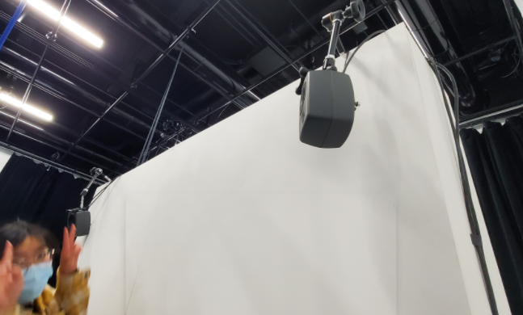
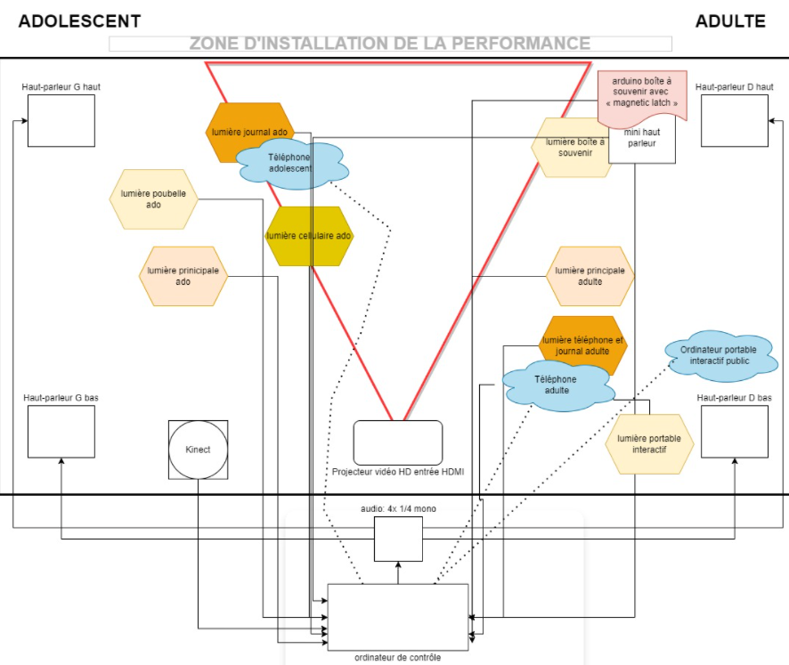

# le titre
Chère Sasha.

## les créateurs et créatrices
Trish Nguyen, Angelina De Silva Jeca, Karine Cormier et Sabrina Kayani.

## la manière dont le thème du temps est exploité dans la création
Le thème du temps est exploité par une vie d'une seule et même personne. Montrant les différentes passages sa vie au fil des années. Passant par la négligence de ses parents à l'adolescence affectant sa santé mentale, jusqu'à sa vie d'adulte un peu plus paisible.
(https://tim-montmorency.com/2022/projets/Chere-Sasha/docs/web/index.html)

## l'ambiance
L'ambiance à l'air plutôt oppressant, le fait de vivre la vie d’un personnage qui se fait négliger et intimider, cela est impressionnant et terrifiant. L'histoire de Sacha n'est pas toute joyeuse mais c'est tout fois intéressant.

## l'installation en cours dans les studios
Toutes les décorations sont présentes, ainsi que l'équipement, les lumières et les haut-parleurs. 

  

(https://tim-montmorency.com/2022/projets/Chere-Sasha/docs/web/index.html)

## le schéma de l'installation prévue

https://tim-montmorency.com/2022/projets/Chere-Sasha/docs/web/preproduction.html

## ce qui sera attendu de nous, en tant qu'interacteur.trice, lorsque nous ferons l'expérience de l'installation
Nous devrions interagir avec certain élément, observer et entendre l'histoire. Le but de l'expérience est juste de vivre l'histoire.

## 3 cours du programme qui nous semblent incontournables pour avoir les compétences pour créer ce projet
Pour ce projet il faut conception sonore, conception vidéo et introduction à la programmation multimédia.
