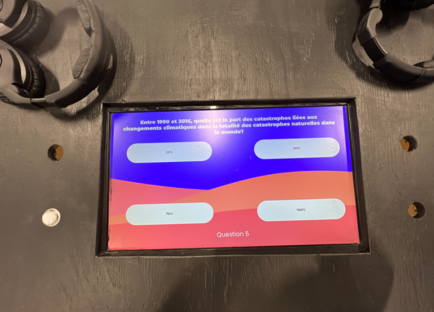
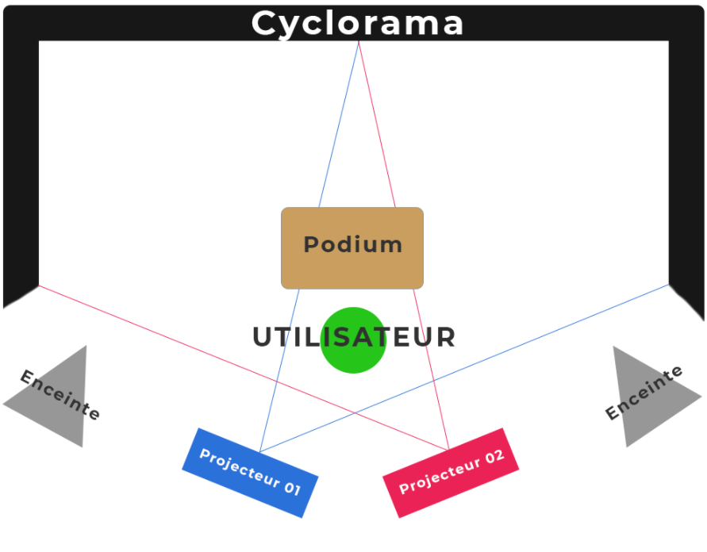

# le titre
Jeu temporel.

## les créateurs et créatrices
Raphaël Fillion et Philippe Trudel.

## la manière dont le thème du temps est exploité dans la création
Le thème du temps est exploité en sensibilisant notre génération sur les conséquences environnementales sur notre avenir. Le thème du quiz est sur les changements climatique, mais en réalité le jeu présente une critique de notre mode de vie.
(https://tim-montmorency.com/2022/projets/Jeu-Temporel/docs/web/index.html)

## l'ambiance
L'ambiance à l'air plutôt amusante et divertissante. Le fait de répondre aux questions et voir le personnage sur le grand écran réagir semble très réjouissant.

## l'installation en cours dans les studios
il y a un ordinateur qui contrôle toute l'installation, un podium, des haut-parleurs, certain câblage et un avancement dans la programmation du questionnaire.

   

(https://tim-montmorency.com/2022/projets/Jeu-Temporel/docs/web/index.html)

## le schéma de l'installation prévue

https://tim-montmorency.com/2022/projets/Jeu-Temporel/docs/web/preproduction.html

## ce qui sera attendu de nous, en tant qu'interacteur.trice, lorsque nous ferons l'expérience de l'installation
On devra répondre aux questions correctement ou faussement pour obtenir différente fin et différente interaction avec le personnage dans le grand écran. Enfaite c'est juste de tester toutes les possibilités que l'installation nous procure.

## 3 cours du programme qui nous semblent incontournables pour avoir les compétences pour créer ce projet
Pour créer ce projet il faut le cours d'introduction à la programmation multimédia, animation 3D et espace interactif. 
